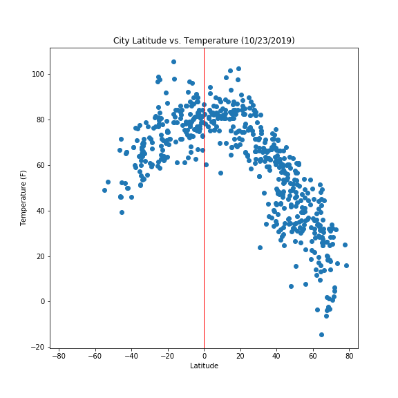

This project can be viewed at https://sanj19.github.io/WeatherViz/WebVisualizations/index.html

This project used HTML, CSS, and Bootstrap to display a project that used Python, Pandas, OpenWeather API, JSON, and matplotlib to analyze how weather varies based on proximity to the equator.

